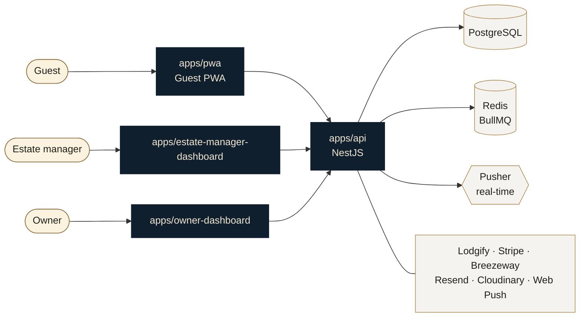

# Villa TimTavio

Operations platform for a single luxury villa — a guest PWA, two staff dashboards and a NestJS API, in one Turborepo.

[](https://nextjs.org)
[](https://nestjs.com)
[](https://www.typescriptlang.org)
[](https://www.prisma.io)
[](https://www.postgresql.org)
[](https://turbo.build)

The villa hosts one party at a time. That single fact shapes most of the design: there is no multi-tenancy, the kitchen cooks for one table, and a "conflict" means one vendor being asked to be in two places at once.

---

## Contents

- [What's in here](#whats-in-here)
- [Architecture](#architecture)
- [Getting started](#getting-started)
- [Environment](#environment)
- [Database](#database)
- [Common tasks](#common-tasks)
- [Deployment](#deployment)
- [Conventions](#conventions)

---

## What's in here

### Applications

| Path | What it is | Dev port |
| --- | --- | --- |
| `apps/pwa` | The guest app. Installable PWA — arrival, manifest, experiences, dining, folio | `3000` |
| `apps/owner-dashboard` | Owner view — revenue, occupancy, satisfaction | `3001` |
| `apps/estate-manager-dashboard` | The estate manager's desk — approvals, bookings, kitchen run sheet, menu, vendors, folio | `3002` |
| `apps/api` | NestJS API, Prisma, PostgreSQL, BullMQ | `4000` |

### Shared packages

| Path | What it is |
| --- | --- |
| `packages/api-types` | The contract. Request/response types and shared helpers, consumed by every frontend |
| `packages/api-client` | Typed fetch wrapper and the single list of API endpoints |
| `packages/ui` | shadcn-based primitives shared across all four apps |
| `packages/dashboard-ui` | Dashboard-only components — data tables, metric cards |
| `packages/theme` | Design tokens: colour, type, spacing, motion |
| `packages/eslint-config`, `packages/typescript-config` | Shared configuration |

> **Note**
> `apps/api` does **not** import `@repo/api-types` — it resolves modules as CommonJS, so a handful of contract types are mirrored by hand in the API and kept in sync deliberately. Where that happens, the file says so.

---

## Architecture



**Authentication is split by audience.** Staff sign in through Auth0 Universal Login. Guests never see Auth0 — they receive a magic link or a six-digit code by email, and the API mints its own short-lived JWT scoped to one booking. A secondary guest's token is re-validated against the manifest on every request, so removing someone from a party revokes their access immediately.

**Bookings come from Lodgify** and are treated as the source of truth; the platform never invents a reservation. **Staff tasks go to Breezeway.** **Vendors are booked by WhatsApp, by hand** — the platform records that conversation rather than trying to replace it.

---

## Getting started

**Prerequisites:** Node 18+, npm 10+, PostgreSQL 14+, Redis.

```bash
git clone https://github.com/malaika22/villa-timtavio-monorepo.git
cd villa-timtavio-monorepo
npm install
```

Set up the API environment and database:

```bash
cp apps/api/.env.example apps/api/.env   # then fill it in — see below
npx prisma migrate deploy --schema apps/api/prisma/schema.prisma
```

Run everything:

```bash
npm run dev
```

Or one app at a time:

```bash
npm run dev --workspace=apps/pwa
```

---

## Environment

Every variable is documented in [`apps/api/.env.example`](apps/api/.env.example). Copy it to `.env` and fill in what you need — the app starts without the optional integrations, and features that depend on a missing key degrade rather than crash.

Each frontend needs its own `.env.local`:

```bash
NEXT_PUBLIC_API_URL=http://localhost:4000
NEXT_PUBLIC_APP_URL=http://localhost:3000
NEXT_PUBLIC_PUSHER_KEY=…
NEXT_PUBLIC_PUSHER_CLUSTER=…
```

> **Warning**
> Anything prefixed `NEXT_PUBLIC_` is inlined into the client bundle and served to every visitor. Only the Pusher **key** and **cluster** belong there — never the app id or secret, which are server-side credentials.

---

## Database

Prisma, PostgreSQL. Migrations are hand-written SQL and additive by default.

```bash
# Apply migrations
npx prisma migrate deploy --schema apps/api/prisma/schema.prisma

# Regenerate the client after a schema change
npx prisma generate --schema apps/api/prisma/schema.prisma

# Inspect
npx prisma studio --schema apps/api/prisma/schema.prisma
```

Seed and maintenance scripts live in `apps/api/prisma/scripts/`. They're plain Node against Prisma Client rather than `.sql`, because the production shell has neither `psql` nor a TypeScript runner:

```bash
cd apps/api && node prisma/scripts/seed-estate-menu.js
```

---

## Common tasks

```bash
npm run build          # build every app and package
npm run dev            # run everything in watch mode
npm run lint           # eslint across the workspace
npm run check-types    # tsc --noEmit across the workspace
npm run format         # prettier
```

Type-check a single app:

```bash
npx tsc --noEmit -p apps/api/tsconfig.json
npm run --silent tsc --workspace=apps/pwa
```

> **Note**
> Type-checking is not sufficient on its own — several classes of error in this repo only surface at build. Run `npm run build` before opening a pull request.

---

## Deployment

| What | Where | How |
| --- | --- | --- |
| API | Render | Docker, from [`render.yaml`](render.yaml). Migrations run on boot |
| PWA, dashboards | Vercel | One project per app, root directory set to the app |

Render's blueprint provisions PostgreSQL and Redis and wires `DATABASE_URL` and the Redis host automatically. Secrets are set in the dashboard and never committed.

---

## Conventions

**Comments explain why, not what.** A comment that restates the code is noise; one that records the bug a line prevents is the only durable place that reasoning lives. Most non-obvious code here carries the case that motivated it.

**The contract lives in one place.** Add a field to `packages/api-types`, add its route to `packages/api-client/src/endpoints.ts`, and every consumer sees it. Endpoints are never string-built at the call site.

**Migrations are additive.** Prefer a nullable column and a backfill to a destructive change. Every migration opens with a comment explaining what it's for and why it's safe.

**Don't build what nobody can reach.** An endpoint with no caller, or a setting with no control, is worse than an absent feature — it reads as working. If a PR adds a capability, it adds the way in too.

**Prices are `Decimal` and serialise as strings.** Coerce once at the boundary; never do arithmetic on the raw value.

---

## Licence

Proprietary. All rights reserved.
